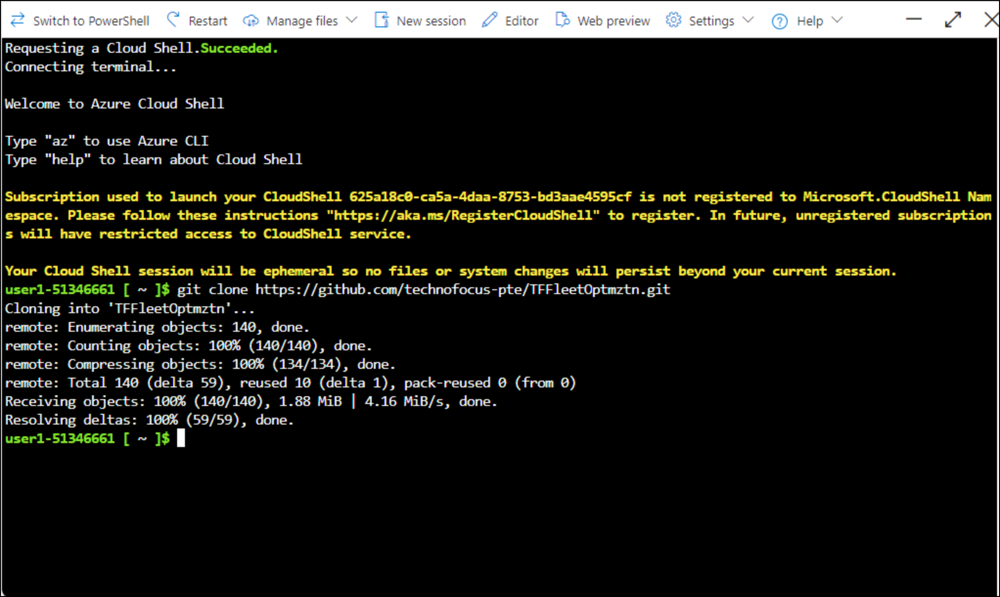
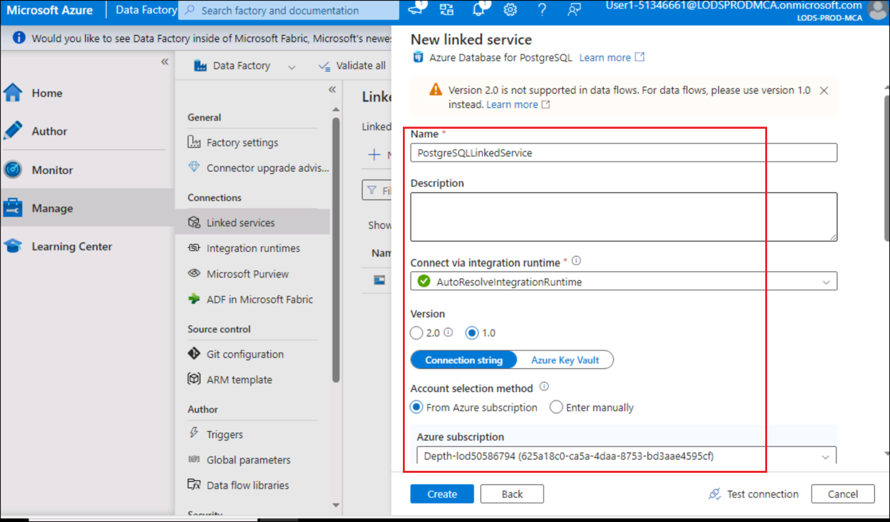
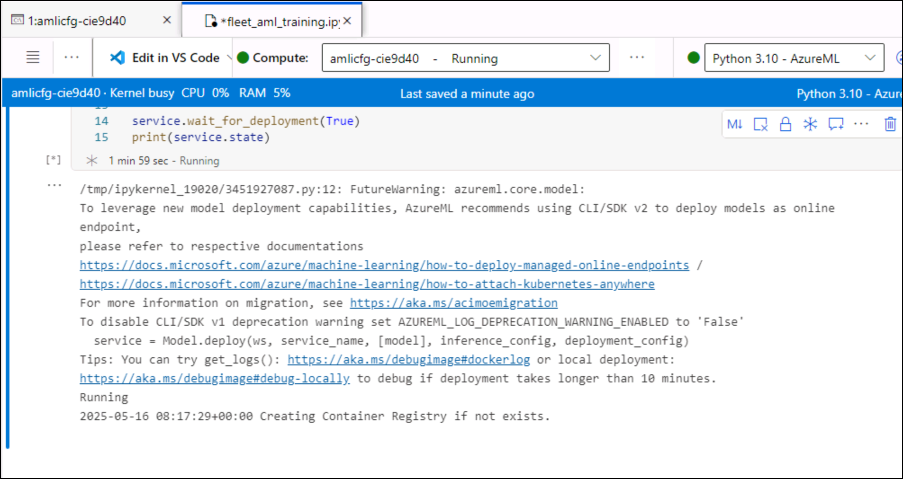
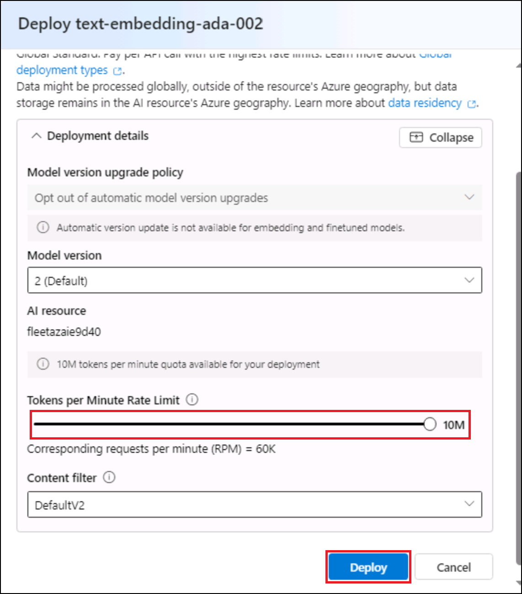
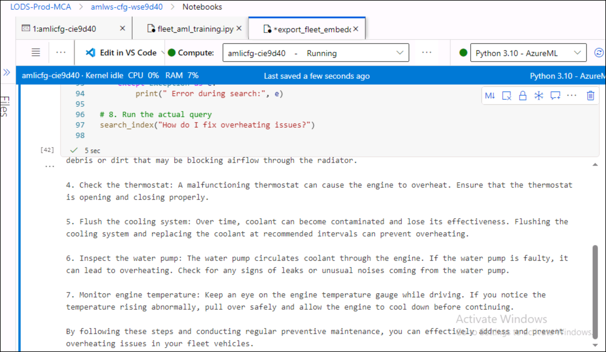
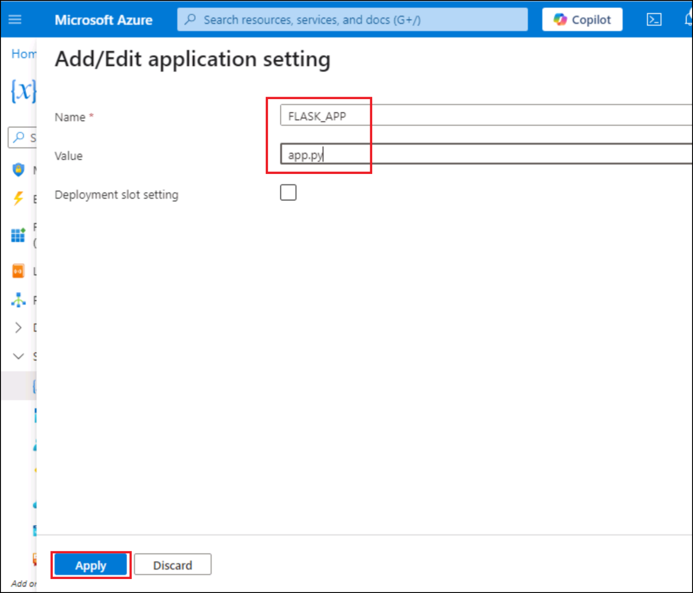
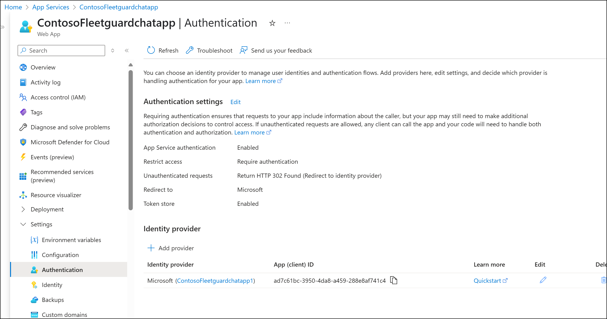

# Next-Gen Fleet Optimization with Azure AI and Machine Learning

**Overview**

In this challenge, you’ll work with a Flask-based conversational
application deployed as an Azure Web App. The solution uses **Azure
OpenAI for LLM-powered insights**, **Azure AI Search for semantic
document retrieval**, and a **PostgreSQL database** to simulate live
vehicle telemetry. Embeddings from PostgreSQL data are generated via
Azure OpenAI and pushed to Azure Search for real-time vector-based
search.

**Objective**

By the end of this hands-on lab, you will:

- Deploy an AI-powered fleet assistant using **Flask**, **Azure
  OpenAI**, and **Azure Search**

- Generate and **push vector embeddings** from PostgreSQL to Azure
  Search

- Create a **chat-based interface** to diagnose and predict vehicle
  issues

**Introduction**

In this challenge, you’ll interact with a fleet chatbot that helps
vehicle operators diagnose real-time issues based on AI-driven insights.
Behind the scenes, the app uses:

- **Azure OpenAI embeddings** for search relevance

- **Azure AI Search** for vector-based retrieval of maintenance logs and
  guidance

- **PostgreSQL** to simulate telemetry and maintenance flags

**Prerequisites**

Participants should have:

- Familiarity with **Python, Flask**, and basic REST APIs

- Basic knowledge of **Azure services**: Azure OpenAI, Azure Search,
  PostgreSQL

- Azure Subscription with OpenAI enabled

- Access to the following tools:

  - Python 3.10+

  - Azure CLI

  - Azure AI Foundry

## Component Overview

[TABLE]

Scenario :

**Contoso Transport Inc., a leading logistics provider, has launched an
AI-powered fleet maintenance assistant to reduce downtime and improve
operational efficiency.**

Drivers interact with the **"Contoso Fleet Guard Chatbot"**, a web app
built using **Flask and Azure App Service**. When a vehicle issue or
query is entered, the message is processed using **Azure OpenAI** for
context understanding.

The system performs **vector-based semantic search** on vehicle
maintenance documents stored in **Azure AI Search**. These embeddings
were generated using Azure OpenAI and indexed alongside metadata
exported from a **PostgreSQL vehicle telemetry database**.

# IMPORTANAT

Open a Notebook from Start menu to save all Azure resources endpoint ,kyes and connection values to use differnet tasks of the labs


## Exercise 1 : Deploy the resources in Azure 

You will deploy Azure Machine learning workspace, create Azure machine
learning compute instance , Azure machine learning compute cluster,
Azure data factory

### Task 1 : Set up environment.

1.  Open a browser and go to +++https://portal.azure.com+++ and sign in
    with your Azure subscription account.

    **Username**: +++@lab.CloudPortalCredential(User1).Username+++

    **Password**: +++@lab.CloudPortalCredential(User1).Password+++

3.  Click on **Cloud Shell** on top navigation menu and select **Bash.**

  

3.  Select **No storage account required** and select your **Azure
    subscription** and then click on **Apply** button.

  

4.  **Run below command to clone the repo**

  +++https://github.com/technofocus-pte/TFFleetOptmztn.git+++

  

5.  Run below commands to navigate to the folder and provide permission
    to the file to run.

   +++cd TFFleetOptmztn/+++

   +++chmod +x setup.sh+++

   

6.  Run below setup script to deploy all the required resources.for the prompt Enter the name of an existing Azure Resource Group: enter
    +++@lab.CloudResourceGroup(ResourceGroup1).Name+++. The deployment take20-30 to deploy all resources.

  +++./setup.sh+++

   

  

  

  

  

  

  

  

  

  

  

  

### Task 2 : Check deployed resources in Azure

1.  On home page of Azure portal, click on Resource group tile.

  

2.  Click on your resource group name.

  

3.  Make sure below resources are deployed.

  - **Azure Machine learning workspace**
  - **Azure Data factory**
  - **Azure database for PostgreSQL**
  -  **Azure OpenAI**
  - **Azure Search service**

 

  

### Task 3 : Create a tables in Azure PostgreSQL

1.  Click on Azure PostgreSQL server name.

  

2.  From left navigation menu, expand **Settings -> Networking**
    .Select **Allow public access from any azure service within Azure
    to this server** check box, click on **Add current IP address((your
    IP address)** and then click on **Save** button

  

3.  Wait for the configuration to be successful.

  

4.  **Click on Server parameters and seach for extensions. Select vector** and **azure-ai extensions** and then click on **Save**

  

5.  Wait for the deployment to complete.

  

6.  Click on **Go to resource.**

  

7.  Click on **Connect** from left navigation menu .Select
    **flexibleserverdb** as database,expand Connect from browser or
    locallay and copy the command. Click on cloud slice icon on top
    navigation menu.Also, make a note of PG_HOST value to use in AML studio- notebook

  

8.  Enter the command then enter password for user citus as :+++Fhtest208+++ and press Enter.

  

9.  Run below command to allow access.

  +++GRANT CREATE ON DATABASE flexibleserverdb TO citus;+++

  

10. Run the below command to create a **contosofleet** table.

  ```
  CREATE TABLE contosofleet (
  RecordID  serial PRIMARY KEY,
  VehicleID INTEGER,
       MeasurementTimestamp TIMESTAMP,
        FleetID   INTEGER,
      TruckID  INTEGER,
      Region INTEGER,
     Mileage INTEGER,
  EngineHealth float,
  SensorData float,
  VehicleSpeedSensor  INTEGER,
  Vibration DOUBLE PRECISION,    
  EngineLoad float,
  EngineCoolantTemp INTEGER,  
  IntakeManifoldPressure INTEGER,
  EngineRPM INTEGER,   
  SpeedOBD INTEGER,
  IntakeAirTemp INTEGER,     
  MassAirFlowRate float,
  ThrottlePosManifold float,
  VoltageControlModule float,
  AmbientAirTemp INTEGER,      
  AccelPedalPosD float,
  EngineOilTemp INTEGER,      
  SpeedGPS INTEGER,
  GPSLongitude float,
   GPSLatitude float,
  GPSBearing float,
  GPSAltitude INTEGER,      
  TurboBoostAndVcmGauge float,
  TripDistance float,
  LitresPer100kmInst  float,
  AccelSsorTotal float,
  CO2InGPerKmInst float,
  TripTimeJourney INTEGER,
  MaintenanceFlag INTEGER
  );
  ```

  

11. Run below command to grant access to the user.

  +++GRANT ALL ON TABLE contosofleet TO citus;+++

  

12. Create another table to export cleaned data –  **Fleet-Clearned_data** table.

  ```
  CREATE TABLE fleet_cleaned_data (
  RecordID  serial PRIMARY KEY,
  VehicleID INTEGER,
  Region INTEGER,
  Mileage INTEGER,
  EngineHealth float,
  SensorData float,
  VehicleSpeedSensor  INTEGER,
  Vibration DOUBLE PRECISION,    
  EngineLoad float,
  EngineCoolantTemp INTEGER,  
  IntakeManifoldPressure INTEGER,
  EngineRPM INTEGER,   
  SpeedOBD INTEGER,
  IntakeAirTemp INTEGER,     
  MassAirFlowRate float,
  ThrottlePosManifold float,
  VoltageControlModule float,
  AmbientAirTemp INTEGER,      
  AccelPedalPosD float,
  EngineOilTemp INTEGER,      
  SpeedGPS INTEGER,
  GPSLongitude float,
   GPSLatitude float,
  GPSBearing float,
  GPSAltitude INTEGER,      
  TurboBoostAndVcmGauge float,
  TripDistance float,
  LitresPer100kmInst  float,
  AccelSsorTotal float,
  CO2InGPerKmInst float,
  TripTimeJourney INTEGER,
  MaintenanceFlag INTEGER
  );
  ```

  

13. Run below command to grant access to the user.

  +++GRANT ALL ON TABLE fleet_cleaned_data TO citus;+++

  

14. Run below command to Install **vecotor** and **azure_ai extensions**

  +++CREATE EXTENSION azure_ai;+++

  +++CREATE EXTENSION vector;+++

  

15. Create a **Table to Store Documents and Embeddings**

You'll need a PostgreSQL table with a column for document text and
another for embeddings.

  ```
  CREATE TABLE maintenance_documents (
      id SERIAL PRIMARY KEY,
      filename TEXT NOT NULL,
      content TEXT NOT NULL,
      embeddings vector(1536)  -- Adjust dimensions based on the embedding model
  );
  ```

  +++GRANT ALL ON TABLE maintenance_documents TO citus;+++

  

# Exercise 2 : Use ADF to clean the data and load it into PostgreSQL.

## Task 1 : Create a Azure Postgresql conneciton

1.  Switch back to Resource group and select **Azure Datafactory**
    resource.

  

2.  Click on **Launch studio** button.

  

3.  Click on **Manage- >Linked service -> New** .

  

4.  Search for +++postgresql+++ and select **Azure Database for PostgreSQL** and then click on **Connect**.

  

5.  Enter below values and then click on Test connection.

  - Name: +++PostgreSQLLinkedService+++
  - Server Name: Select your PostgreSQL server name (e.g., <yourserver>.postgres.database.azure.com).
  - Version : **1.0**
  - Database Name: **flexibleserverdb**.
  - Authentication: Provide the username and password.(+++citus+++ – +++Fhtest208+++
  - Encryption Method : **SSL**
  - Click **Test Connection** to verify.

   

   

6.  Click on **Create** now.

  

  

## Task 2 : Create a Pipeline and Dataflow to Transfer Data

1.  In Azure Data Factory, go to the **Author** tab (pencil icon on the left).Click **Pipeline-> New Pipeline**

  

2.  Name it +++IngestBlobToPostgreSQL+++

  

3.  Click **Move and transform →** Drag **Copy data** action to the canvas 

  

4. Enter **Copy data name**: +++blobtopostgresql+++

  

5. Click on **Source** tab and select **New** next to **Source dataset** drop down.

  

6. Search for +++blob+++, select **Azure blob storage** and click on **Continue**.

  

7. Select **Delimited Text** format and click **Continue**.


8. Enter the name as +++blobfleetdata+++, select your blob linked service 
    and then click drop down next to **File path** and select **From
    root.**

  

9. Double click on **fleetdata** folder and select **fleet_data.csv** file and then click on **Ok**.

  

  

10. Click on **Ok**.

  

  

11. Click on **Sink** tab and then click on **New** next to **Sink dataset** drop down.

  

12. Search for +++postgresql+++ ,select **Azure Database for PostgreSQL** and click **Continue**.

  

13. Set below properties and then click on OK.

  - **Name** : +++AzurePostgreSqlcontosofleettable+++
  - **Linked Service** : **PostgreSQLLinkedService**
  - **Table name** : Search for +++public.contosofleet+++ and select it.

  
  
14. Click on **Mapping** tab.

  

15. Click on **Import schema**

  

16. Add Data flow to the Copy data action. Select **Data Flow**

  

17. Name the data flow - +++Cleandataindataflow+++

  

18. Click on **Settings -> New** next to **Data flow**.

  

## Task 3 : Create Dataflow.

1.  You are navigate to new Data flow window. Name the data flow as +++Cleandatainpostgresqldataflow+++ and then select Add source action.

  

2. Name the output stream – +++datacleanpostsql+++ and select    **AzurePostgreSqlcontosofleettable** dataset

  

3. Turn on **Data flow debug** and click Ok.

  

4. Select source action and click on + and click on **Select** action.

  

5. Select the box and enter **Output steam name** as - +++dropcolumns+++

  

6. Scroll down and select **MeasurementTimestamp , fleetid and  truckid** column and then click on **Delete**.

  

7. Click on + next to the tile and select **Derived Column** option
    from the list.

  

8. Select the Derived Column option and enter Output steam name as – +++repalcenullvalues+++ and click on **Open expression builder** link

  

9. Create/Enter column names and their **Expression** as per the below table

  |Column Name|Expression|
  |--|--|
  |+++enginecoolanttemp+++|+++coalesce(toInteger(enginecoolanttemp), 25)+++|
  |+++ambientairtemp+++|+++coalesce(toInteger(ambientairtemp), 25)+++|
  |+++intakeairtemp+++|+++coalesce(toInteger(intakeairtemp), 25)+++|
  |+++enginerpm+++|+++coalesce(toInteger(enginerpm), 800)+++|
  |+++vehiclespeedsensor+++|+++coalesce(toInteger(vehiclespeedsensor), 0)+++|

  

  

  

10. then click on **save and finish** button

  

  

11. Select **repalcenullvalue** action and add **Filter** under Row modifier section.

  

12. Enter the output steam name - +++filterrpm+++ and the expression -+++enginerpm>=500&&enginerpm<=6000+++
    
   

13. Add another filter map

  

14. Name the filter – +++filtervehiclesensor+++ and add below expression

  +++vehiclespeedsensor >= 0 && vehiclespeedsensor <=200+++

  

15. Add **Sink** to the **filtervehiclesensor** map.

  

16. Name - +++tofleetcleanedtable+++* , add the description - +++export cleaned
    data to fleet_cleaned_data table+++ and click on **New** next to
    **Dataset** dropdown

  

17. Search for +++postgresql+++ and select **Azure Database for PsotgreSQL**
    tile and then click on **Continue**.

  

18. Enter below values and click on **OK**.

  - **Name** : +++cleandatatoPostgreSqlTable+++
  - **Linked Service** : +++PostgreSQLLinkedService+++
  - **Table name** : +++public.fleet_cleaned_data+++

  

19. Click on **Validate all** and close the notification.

  

## Task 4 : Test the Pipeline

1.  Switch back to pipeline and click on **Validate** all to validate
    the pipeline. Close the notification .

  

2.  Click on **Debug** and wait until its success.

  

  

3.  Go the Data flow and select Sink ,Click on **Data Preview ->Refresh.** Data gets displayed.

  

4.  Go back pipeline and click on **Publish all**

  

5.  Click on **Publish** button.

  

  

# Exercise 3: Set Up Your Azure Machine Learning Environment

## Task 1 : Connect to AML Studio and run Notebook

1.  Switch back to **Azure portal -> Resource group** and select your  Azure machine learning resource.

  

2.  On Overview page, click on **Launch studio.**

  

3.  Click on **Compute** from left navigation menu .Select the compute instance and select on **Notebook**.

  

4.  Close the what’s new in Notebook window.

  

5.  Click on **Terminal** and run the below command to clone the repo.

  +++https://github.com/technofocus-pte/TFFleetOptmztn.git+++

 

3.  Click on Refresh to load the repo.

  

4.  Expand the **repo -> notebooks** and select **fleet_aml_training** notebook. click on **Authenticate** .

  

5.  It opens a new tab to sign in with your Azure subscription
    account.Sign in with your Azure subscription account.Select **Python
    3.10- AzureML** kernel

   

6.  Open new terminal .Run below command and enter **y** when asked to
    proced.

   +++conda update -n base -c conda-forge conda+++
 
   

   

7.  Run **requirements.txt** cell to install all dependencies.

  

8.  Update **.env** cell with your Azure resource details and run it

  

9.  Run the cell to connect to AML Workspace cell.

   

10. Run the cell to connect to PostgreSQL and import cleaned data.

  

11. Run the cell to plot the Maintenance flag distribution.

  

  

  

12. Run the script to create environment cell and run it.

 

 

13. Run View registered environments cell .

  

14. Run the cell to create training script - **fleet_training.py**

  

15. Refresh the root folder and you should see training script file got
    created.

  

16. Run the cell to run an experiment on remote compute

17. Run the cell to get the cluster.

  

  

18. Run the train cell to train the model.It takes 5-10 minutes to run
    the script completely.

  

  

  

19. Run Get logged metrics code cell.

  

20. Run the register model code cell to register the model.

  

  

21. Run cell to Create a folder for the web service files

  

22. Run the cell to write score_fleet.py

  

23. Now Deploy the model as a web service .Run the cell. Deployment takes 10-15 minutes to complete.

  

  

24. Run the cell to get endpoint

  

  

25. Run the cell to enable authentication.

  

26. Run the cell to get endpoint and key to use in next cells and tasks.

  

27. Update endpoint and key values and run the cell to test predictions.

  

  

  

  

# Exercise 4: Create and export embeddings 

## Task 1 : Configure settings in Azure AI search service

1.  Click on Resource group name and then select your Azure Search
    service.

  

2.  Select Identity under Settings , ON the status and save it.

  

3.  Select **Yes**.

  

4.  Select **Keys** form left navigation bar and select both option. Wait for the change to be successful.

  

  

## Task 2 : Create index

1.  Click on **Search management ->indexes** from left navigation and  select **Add index -> Add index**

  

2.  Enter the index name as : +++fleet_index+++ and click on **Add field.**

  

3.  **Create fields as per below table**

  |||||||||
  |**Field Name**|**Data Type**|**Searchable**|**Filterable**|**Sortable**|**Facetable**|**Retrievable**|**Dimentions**|
  |**filename**|Edm.String|yes|yes|yes|No|yes||
  |**content**|Edm.String|No|Yes|No|No|No|Yes||
  |**embedding**|Collection(Edm.Single)|Yes|No|No|No|Yes|**1536**|

  

  

4.  Enter Dimensions as +++1536+++ and then click on Create under **No vector search profile**

  

5.  Click on **Create.**

  

6.  Keep default values and then click on **Save** under **Vector  algorithm**

  

7.  Click on **Save** again.

  

8.  Click on **Save** in Index Field section.

  

9.  Once all fields and settings are filled in, click **"Create"**.

  

  

## Task 3 : Deploy embedding model.

1.  Switch back to Resource Group and select **Azure OpenAI resource**.

  

2.  Click on **Go to Azure AI Foundry portal**

  

3.  Click on **Deployments** from left navigation menu and select **Deploy model -> Deploy base model.**

  

4.  Search for +++text-embedding-ada-002+++ model and select it and then click on **Confirm** button.

  

5.  Click on **Customize** button.

  

6.  Keep all the default values . **Increase Tokens per Minute Rate Limit to max tokens** and then click on **Deploy**.

  

  

## Task 4 : Deploy embedding model.

1.  Click on **Deployments** from left navigation menu. Select **Deploy model -> Deploy base model.**

  

2.  Search for +++gpt+++ model and select **gpt-35-turbo** ( any available chat model in resource region) and then click on **Confirm**.

  

3.  Keep all the default values and then click on **Deploy** button.

  

  

## Task 5 : Export embeddings to Azure AI search.

1.  Switch back to Azure Machine learning studio and select **export_fleet_embeddings.ipynb**

  

2.  Run dependencies cell to install dependencies

  

3.  Run cell to List of .docx files in the Data folder

  

4.  Update the environment variables with your azure resource values and then run to write values to .env values.

  

5.  Run cell to assign documents.

  

6.  Run cell to Insert documents into PostgreSQL table

  

7.  Run cell to Fetch records from the table

  

  

8.  Run cell to get embeddings.

  

  

9.  Run cell to export embeddings to Azure AI Search

  

10. Run cell to Ru cell to create maintenance_documents.jso file

  

11. Run cell to list indexes

  

12. Run cell to upload documents to index **'fleet_index'**

  

  

13. Run cell to check the response for the prompt

  

  

14. Update cell with chat model name for engine and run it.

  

15. Run last cell to check responses for the prompts.

  

  

# Exercise 5 : Build and deploy Azure AI fleet guard chatapp

### Task 1 : Build fleetguard app locally

1.  Create fleetapp folder on your vm desktop.

  

2.  Open visual Studio code from Dekstop. Click on **File-> Open Folder.**

  

3.  Browse Desktop and select the fleetapp folder created on desktop.

  

4.  Open new Terminal.

  

5.  Run the command to clone the repo.

   +++git clone https://github.com/technofocus-pte/TFFleetOptmztn.git+++

  

6.  Expand chatapp folder and update .env file with your azure resource values.Save the file

  

  

7.  Run below command to navigate to the folder.

  +++cd .\TFFleetOptmztn\chatapp\+++

  

8.  Run below dependencis in terminal

  +++pip install openai==0.28+++

  +++python.exe -m pip install --upgrade pip+++

  +++pip install -r requirements.txt+++

  +++python -m pip install --user -r requirements.txt+++

  +++pip install openai[datalib]++

  

  

9.  Run below command to run the app locally.Click on **Allow access**
    button on pop up window

   +++python app.py+++

  

10. Click on localhost url (ctrl+ click)

  

11. App opens in default browser.

  

12. Enter the below prompts and click on **Send**.

  +++my vehicle - 98765 has enginehealth - 0.826120+++

  +++Predict maintenance issues for my vehicle with 80,000 km mileage+++

  +++Will my car overheat based on engine temperature 90°C?+++

  +++vehicle 24353 's enginehealth is 0.9 and vehicle sensor speed is 101+++

  +++What should I do if my engine health is below 0.5?+++

  

  

  

  

  

### Task 2 : Insall extension in visual Studio code.

1.  Switch back to Visual Studio code and click on **Extensions** from
    left navigation menu, search for Azure Developer CLI and install it.

  

2.  Click on **Azure** icon from left navigation menu and select **Sign
    in to Azure**.

  

3.  Click on **Allow**.Sign in with your assigned account.

  

  

4.  Click on **Extensions** and search for **Azure App Service** and **install** it.

  

### Task 3 : Create a web app 

1.  Click on **Azure** icon from left navigation and right click on
    **App service** and select **Create New Web App**

  

2.  Select a any region to deploy your app

  

3.  Enter unique name (+++fleetguardXXXXX+++- XXXXX can be unique number)for your app and press Enter.

  

4.  Select **Python 3.10**

  

5.  Select Basic price tier.

  

6.  Wait for the app to create.

  

### Task 4 : Deploy the App

1.  Go to the **chatapp** folder , right click on the folder and select **Deploy to web app**.

  

2.  Select the webapp you created above.

  

3.  Click on **Deploy** now.

  

4.  Wait for the deployment to complete.

  

### Task 5 : Configure the fleet app.

1.  Open Azure portal, search **App service** and open it.

  

2.  Select your app name

  

3.  Select **Environment variables under Settings** from left navigation menu and click on **Add**

  

4.  Add below variables with their values

  

5.  Add +++FLASK_APP+++ and value as +++app.py+++

  

6.  Add +++WEBSITES_PORT+++ and value as +++8000+++

  

7.  Click on **Apply** -> **Confirm**

  

  

8.  Click on **Configuration** and add startup command as - +++python -m flask run --host=0.0.0.0 --port=8000+++

   

9.  Add Microsoft as identity provider

  

10. Click on **Continue**.

  

11. Click on identity from left navigation menu, On the status and  Save-> Yes

   

12. Click on **Authentication** form left navigation bar and select  **Add identity provider.**

  

13. Select below values and keep all default values and then click on **Next: Permissions.**

  - **Identity provider** : **Microsoft**

  - **Client secret expiration** : **90 dayes**

  

14. Click on Add permission. Expand Applicaions , select **Application.ReadWrite.All Read and write all applications** check box
    and then click on Update permissions.

  

15. Click on Add now.

  

  

### **Task 6 : Access the Fleetguard app**

1.  Click on **Overview** and select **Default domain** link.

  

2.  App opens in new tab. Wait and click on Accetp.

  

  

3.  Enter below prompts and check responses.

  - +++my vehicle - 98765 has enginehealth - 0.826120+++
  - +++Predict maintenance issues for my vehicle with 80,000 km mileage+++
  - +++Will my car overheat based on engine temperature 90°C?+++
  - +++vehicle 24353 's enginehealth is 0.9 and vehicle sensor speed is 101+++
  - +++What should I do if my engine health is below 0.5?+++
  - +++There's a burning smell and smoke from the exhaust+++

  

  

  

  

  

  
